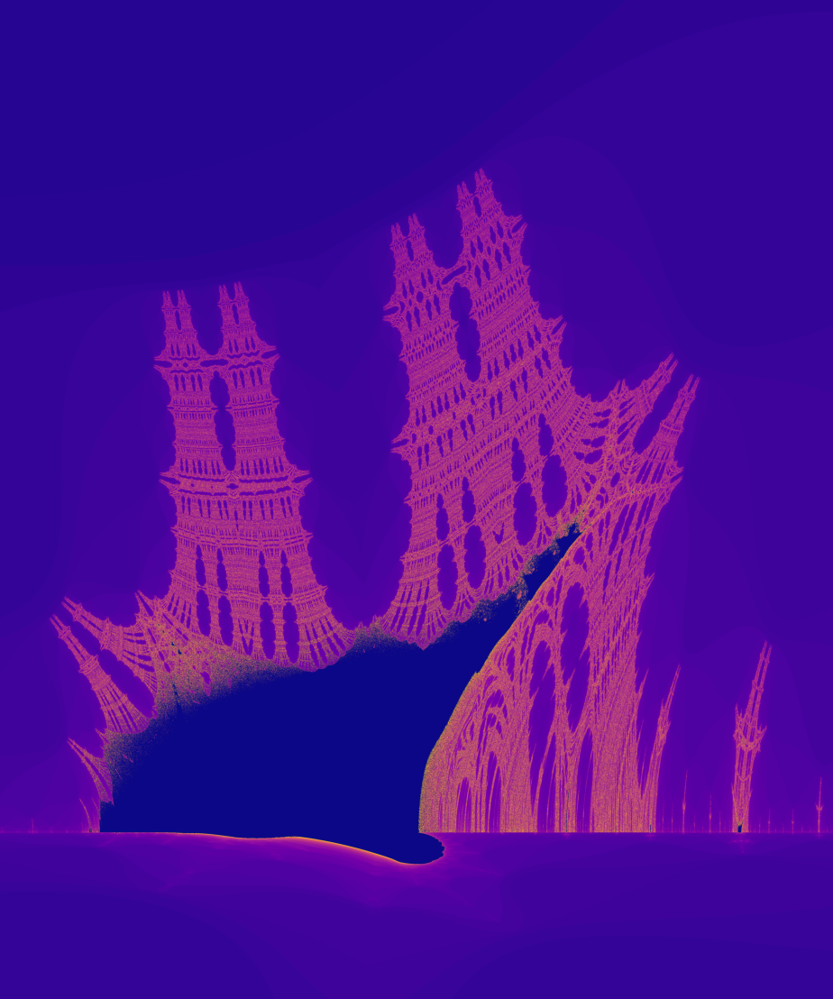

# Burning Ship Fractal
This Python script generates a zoomed-in section of the Burning Ship fractal, focusing on the bottom-left region. The fractal image is created using NumPy for calculations and Matplotlib for visualisation. Users can customise parameters to explore different regions of the fractal.  
  
The generated fractal is saved as `burning_ship.png` and displayed on screen.

## Requirements
* Python 3.x (https://www.python.org/downloads/)
* NumPY
* Matplotlib

Install libraries using:
```
pip install numpy matplotlib
```

## Execution
Run the script using:
```
python burning_ship.py
```

## Customisation
* __Zoom Region__: Alter the zoom area:
```
min_x = -1.80
max_x = -1.70
min_y = -0.10
max_y = 0.02
``` 
* __Image Resolution__: Control image size and fractal detail:
```
width = 5000
height = 5000
max_iterations = 100
```
```
plt.imshow(image, cmap='plasma', extent=(-1.80, -1.70, -0.10, 0.02))
```
Other colourmaps include: `inferno`, `magma`, `viridis` and more.

## Preview:

